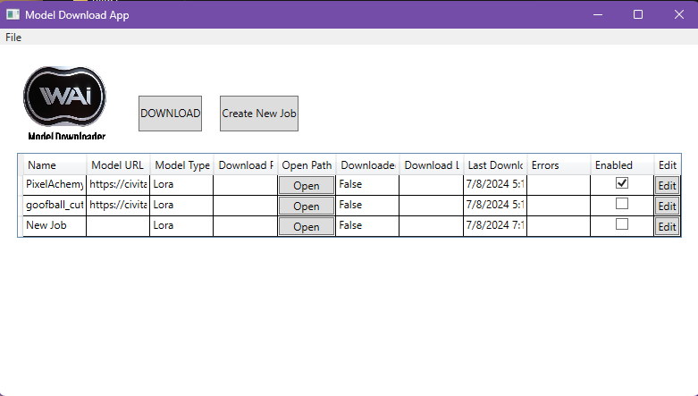
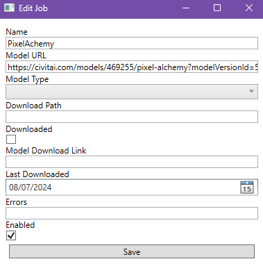
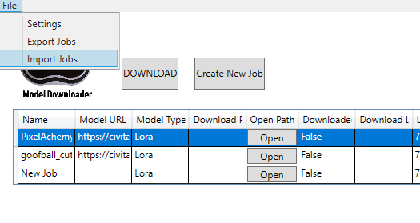
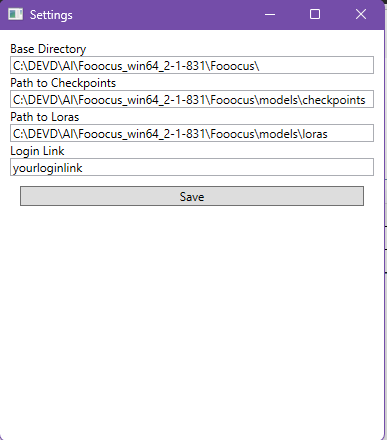

# WAIModelDownloader

WAIModelDownloader is a WPF application designed to automate the downloading and management of machine learning models from various sources. This application allows users to configure download jobs, extract and download model files, and manage these models efficiently. The app supports different types of models including LoRA, Checkpoints, and ControlNet models, and is particularly useful for those working with Stable Diffusion models.

## Features
- Configure multiple download jobs with details such as model URL, type, and download path.
- Extract model information from web pages and download the model files.
- Manage and organize downloaded models in specified directories.
- Edit job details and update settings through a user-friendly interface.
- Authentication support for sources requiring login.
- Backup download link generation to ensure reliable access to model downloads.

## Installation

1. **Download the latest release:**
   - Navigate to the [Releases](https://github.com/gxrwes/WAI-ModelDownloadManager/releases) page of the repository.
   - Download the latest `WAIModelDownloader_<timestamp>_<commit>.zip` file.

## Alternatively

1. Clone the repository:
   ```bash
   git clone https://github.com/yourusername/WAIModelDownloader.git
   ```

2. Open the solution in Visual Studio.

3. Build the project:
   - Navigate to `Build` -> `Build Solution` or press `Ctrl+Shift+B`.

4. The build artifacts will be located in the `build/WAIModelDownloader` directory.

## Setup

1. **Configuration Files**: The application uses `settings.json` and `credentials.json` for configuration.
   - `settings.json`:
     ```json
     {
         "BaseDirectory": "C:\\Path\\To\\Your\\BaseDirectory\\",
         "PathCheckpoints": ["C:\\Path\\To\\Your\\BaseDirectory\\models\\checkpoints"],
         "PathLoras": ["C:\\Path\\To\\Your\\BaseDirectory\\models\\loras"],
         "PathEmbeddings": "C:\\Path\\To\\Your\\BaseDirectory\\models\\embeddings",
         "PathVaeApprox": "C:\\Path\\To\\Your\\BaseDirectory\\models\\vae_approx",
         "PathVae": "C:\\Path\\To\\Your\\BaseDirectory\\models\\vae",
         "PathUpscaleModels": "C:\\Path\\To\\Your\\BaseDirectory\\models\\upscale_models",
         "PathInpaint": "C:\\Path\\To\\Your\\BaseDirectory\\models\\inpaint",
         "PathControlnet": "C:\\Path\\To\\Your\\BaseDirectory\\models\\controlnet",
         "PathClipVision": "C:\\Path\\To\\Your\\BaseDirectory\\models\\clip_vision",
         "PathFooocusExpansion": "C:\\Path\\To\\Your\\BaseDirectory\\models\\prompt_expansion\\fooocus_expansion",
         "PathWildcards": "C:\\Path\\To\\Your\\BaseDirectory\\wildcards",
         "PathSafetyChecker": "C:\\Path\\To\\Your\\BaseDirectory\\models\\safety_checker",
         "PathOutputs": "C:\\Path\\To\\Your\\BaseDirectory\\outputs"
     }
     ```
     - Replace all placeholder paths with actual paths in your environment.

   - `credentials.json`:
     ```json
     {
         "LoginLink": "your_login_link"
     }
     ```

2. **Run the Application**:
   - Press `F5` in Visual Studio to start the application.

## Usage

1. **Main Window**:
   - The main window allows you to manage your download jobs.
   

2. **Configuring Download Jobs**:
   - Open the application and navigate to the main window.
   - Click on `Add Job` to create a new download job.
   - Fill in the details such as Name, Model URL, Model Type, and Download Path.
   - Click `Save` to add the job to the list.
   

3. **Managing Jobs**:
   - Select a job from the list and click `Edit Job` to modify its details.
   - Use the `Delete Job` button to remove a job from the list.
   

4. **Downloading Models**:
   - Click the `Download` button to start the download process for all enabled jobs.
   - The download progress will be displayed in a separate window.

5. **Settings**:
   - Click on `Settings` to open the settings window.
   - Update the Base Directory, Paths, and Login Link as needed.
   - Click `Save` to apply the changes.
   

## Roadmap

- [ ] Implement model validation before download.
- [ ] Add support for additional model types.
- [ ] Enhance error handling and logging.
- [ ] Implement automatic updates for the application.
- [ ] Add user authentication and management features.

## Patchnotes

### Version 1.0.0
- Initial release with basic functionality for managing and downloading model files.
- Support for LoRA, Checkpoints, and ControlNet models.
- Basic settings and credential management.

### Version 1.1.0
- Added user interface improvements and bug fixes.
- Enhanced the settings window to include credential management.
- Improved download job management and logging.

### Version 1.2.0
- Implemented backup download link generation.
- Various bug fixes and performance improvements.
